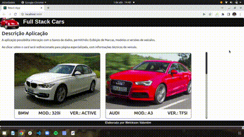

# Boas vindas ao Projeto Full Stack Cars

Este projeto renderiza lista de veículos, armazenados em banco de dado remoto e conectado pela estrutura do back end.

## Funcionalidades da aplicação

Com esta aplicação podemos visualizar lista de veículos, com descrição de marca, modelo e versão.
Ao clicar sobre o card abre-se uma nova página, do site WebMotors, com as especificações técnicas de cada modelo.
Todas as informações utilizadas estão armazenadas no banco de dados e passíveis de manipulação.

### Tecnologias utilizadas

Aplicação desenvolvida com `React.js`, com gerenciamento de estado por meio de `Hooks`.
Aplicação recebe e trata promisses proveniente do retorno de informações do projeto `Back End`.
Estilização da página desenvolvida para mobile first e responsividade ao tamanho da tela, 
desenvolvida em `Bootstrap`.

### Acesso ao Deploy do projeto

Realizado deploy da aplicação na plataforma Heroku e disponível em:
*https://listofcarsfrontend.herokuapp.com/cars

### Ilustração da aplicação em funcionamento

## Para rodar a aplicação localmente

1. Clone o repositório, com o comando:
    *`git clone git@github.com:welcksonvalentim/listofcarsfrontend.git`
`
2. Entre na pasta do repositório que você acabou de clonar:
    * `cd listofcarsfrontend`

3. Instale as dependências e inicialize o projeto:
    * `npm install`

4. Inicialize o projeto:
    * `npm start`

